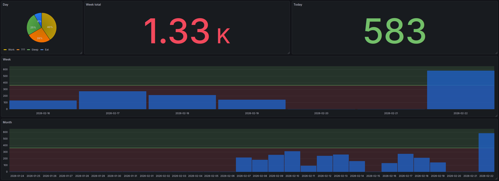

Productivity Notifier
---

It's impossible to explain the 

Allows to track your work time and display it in any way (using grafana). Provides two API points (`/start` & `/end`) to track your time, and `/query` for sql queries.

## Safety

It's recommended to place this in private networks (e.g., ZeroTier provides free mesh network for your devices). 

Each request is safeguarded with header `SECRET`, which is defined by `HEADER_SECRET` env variable.

## Usage

1. Spin up on your laptop/server:
```shell
docker build -t performance .
docker run -d --name performance -p 3232:3232 -e HEADER_SECRET=RANDOM_SECRET performance
```
2. Add aliases to commands you use while programming. 
For example, if you start your session by starting up your pc, add api call to your `.bash_profile` and when shutdown is called, send request to `/end`.

My `.bash_profile`:
```
[[ -f ~/.bashrc ]] && . ~/.bashrc
# Some configurations...
xh "10.147.18.68:3232/start" SECRET:my_secret
```

## Docs

Automatic docs are located at `/docs` (also safeguarded with header secret).

## Example Grafana (mock data)



Configuration is not provided on purpose. Try to play with this wonderful service.

## License

This project is licensed under the MIT License - see the LICENSE file for details.
